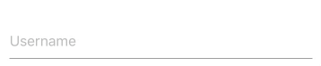
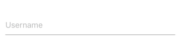
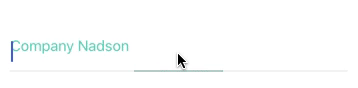
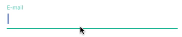
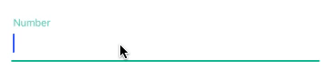
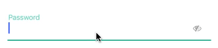
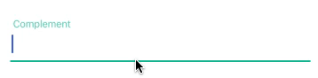
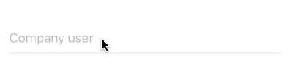
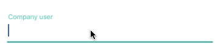
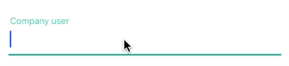

# input-materialdesign-widget
[](http://gitt.io/component/input-materialdesign)

Appcelerator TextField Material Design concept!

This is a widget based on [Material Design](https://material.io/guidelines/) concept, which works for iphone, ipad and android, even Android.

## Installation

Use [Gittio](http://gitt.io/) to install:

```sh
$ gittio install input-materialdesign@version
```

## Usage

It is quite simple to create a widget, just declare your widget in the xml, with only a property called 'titleHint' and is ready to use. You choose to collocate the attributes either in the 'xml' file in question or in the 'tss' file (recommended) to maintain a cohesion and responsibility for each layer. 

This component is well decoupled, being able to stylize and interact with it
Below you will see some examples.

#### Simple input



```xml
<Widget src="input-materialdesign" id="textfieldTest"/>
```
```tss
"#textfieldTest": {
    titleHint: "Username"
}
```

#### Input with character counter
Input with character counter, the maximum number of characters is set, when the component exceeds, the component shows an error notification.



```xml 
<Widget src="input-materialdesign" id="textfieldTest" />
```
```tss
"#textfieldTest": {
    titleHint: "Username",
    maxLength: 10
}
```

### Input with required fields
When a field is orbit.

 

```tss
"#textfieldTest": {
    required: "Required field"
}
```

### Input with validation email and number
It is possible to validate if the field typed is an email or a valid number through the 'maskType' attribute (email, number).

 

#### `email`
```tss
"#textfieldTest": {
    maskType: "email"
}
```
 

#### `number`
```tss
"#textfieldTest": {
    maskType: "number"
}
```

#### Input with password
Just by setting the 'password' property the component already hides the characters.

 

```xml 
<Widget src="input-materialdesign" id="textfieldTest" />
```
```tss
"#textfieldTest": {
    titleHint: "Password",
    password: true
}
```

It is also possible to add an action icon in the component, just by setting the 'iconAction' property in the file and 'tss' and creating a controller file for a callback function, see:

`The code passed in the 'iconAction' attribute is some 'Fontawesome' unicode, you can use any icon in the link below, just pass the unicode correctly.`

[Fontawesome.io/icon](http://fontawesome.io/icons/)

 

```xml 
<Widget src="input-materialdesign" id="textfieldTest" />
```
```tss
"#textfieldTest": {
    titleHint: "Password",
    password: true,
    iconAction: '\uf070', 
}
```
```js
var _toFlag = false;
$.textfieldTest.clickIconAction(function(e) {
	$.textfieldTest.setValue('');
	$.textfieldTest.setIconAction('');
	if(!_toFlag) {
		$.textfieldTest.setPasswordMask(false);
		 $.textfieldTest.setIconAction('\uf06e');
		_toFlag = true;		
	} else { 
		$.textfieldTest.setPasswordMask(true); 
		$.textfieldTest.setIconAction('\uf070');
		_toFlag = false;
	}
});
```

### another examples
 

Now it is possible to choose 3 types of animation besides the default [leftToRight, leftToRightToRightOut, expand]

#### `leftToRight`


#### `leftToRightToRightOut`


#### `expand`


```xml
<Widget src="input-materialdesign" id="textfieldTest"/>
```
```tss
"#textfieldTest": {
    titleHint: "Company User",
    animationType: 'leftToRight' // or leftToRightToRightOut or expand, When you do not add anything, it's standard animation.
}
```

## Methods
There are the methods available to access from `.js` files.

| Functions | Description |
--- | --- |
| `getValue` | Returns the value of input |
| `setValue` | Assigns value to input |
| `setEditable` | The input block |
| `focus` | Gives focus on field |
| `blur` | Take the focus away from the camera |
| `ANIMATION_UP` | Animation rise |
| `ANIMATION_DOWN` | Animation descent |
| `listener(event, callback)` | Assigns event for input , listening to a callback |
| `clickIconAction(callback)` | IconAction's click return function |
| `setPasswordMask(value)` | Defines whether the field will show or hide the characters |
| `setIconAction(value)` | Defines action icon |
| `setEditable(value)` | Defines whether the component will be locked or not |


## Attributes

There are all attributes supporting by this widget.

| Attributes | type | Description |
--- | --- | --- |
| `animationDuration` | Number | Duration animation |
| `width` | String, Number | Sets the width |
| `colorFocus` | String | Sets the color when the focused field |
| `colorDefault` | String | Sets the standard color when the field started |
| `colorFont` | String | Sets the font color |
| `titleHint` | String | Sets title |
| `top` | String, Number | Defines the top |
| `bottom` | String, Number | Defines the bottom |
| `left` | String, Number | Defines the left |
| `right` | String, Number | Defines the right |
| `keyboardType` | String | Defines the keyboardType |
| `returnKey` | String | Defines the returnKey from keyboard |
| `password` | String | Defines if TextField should have passwordMask |
| `editable` | Boolean | Defines whether the input starts blocked |
| `maxLength` | Number | Defines the maximum number of characters |
| `minLength` | Number | Defines the minimum number of characters |
| `exceedingColor` | String | Set the color when it exceeds the reported number of characters |
| `toUpperCase` | Boolean | Sets the field to get me high box |
| `maskType ['number' or 'email']` | String | Defines whether some shade to the field, as there is no default , but can be defined as numeric, accepting only numbers, or you can spend a regular expression whatsoever. |
| `maskTypeDescription` | String | Description of the alert |
| `required` | String | Defines whether the field is required , passing a message as parameter |
