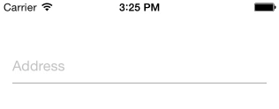

# input-materialdesign-widget
[](http://gitt.io/component/input-materialdesign)

Appcelerator TextField Material Design concept!

This is a widget based on [Material Design](https://material.io/guidelines/) concept, supporting multiple platforms, even android.


## Installation

Use [Gittio](http://gitt.io/) to install:

```sh
$ gittio install input-materialdesign@version
```

## Examples

#### Simple input



```xml
<Alloy>
    <Window id="win">
        <Widget src="input-materialdesign" titleHint="Address"/>
    </Window>
</Alloy>
```

#### Input with required fields


```xml 
<Alloy>
    <Window id="win">
        <Widget src="input-materialdesign" required="Required Field" titleHint="Address"/>
    </Window>
</Alloy>
```

#### Input with maxLength

 

```xml
<Alloy>
    <Window id="win">
        <Widget src="input-materialdesign" maxLength="10" titleHint="Complement"/>
    </Window>
</Alloy>
```

#### Input with Mask
Through the mask attribute is possible to pass a regular expression to filter the field as the same .

```xml
<Widget src="input-materialdesign" mask="/^[0-9]+$/"/>
```

## Methods
There are the methods available to access from `.js` files.

| Functions | Description |
--- | --- |
| `getValue` | Returns the value of input |
| `setValue` | Assigns value to input |
| `setEditable` | The input block |
| `ANIMATION_UP` | Animation rise |
| `ANIMATION_DOWN` | Animation descent |
| `listener(event, callback)` | Assigns event for input , listening to a callback |


## Attributes

There are all attributes supporting by this widget.

| Attributes | type | Description |
--- | --- | --- |
| `animationDuration` | Number | Duration animation |
| `width` | String, Number | Sets the width |
| `colorFocus` | String | Sets the color when the focused field |
| `colorPattern` | String | Sets the standard color when the field started |
| `colorFont` | String | Sets the font color |
| `titleHint` | String | Sets title |
| `top` | String, Number | Defines the top |
| `bottom` | String, Number | Defines the bottom |
| `left` | String, Number | Defines the left |
| `right` | String, Number | Defines the right |
| `keyboardType` | String | Defines the keyboardType |
| `returnKey` | String | Defines the returnKey from keyboard |
| `password` | String | Defines if TextField should have passwordMask |
| `editable` | Boolean | Defines whether the input starts blocked |
| `maxLength` | Number | Defines the maximum number of characters |
| `minLength` | Number | Defines the minimum number of characters |
| `exceedingColor` | String | Set the color when it exceeds the reported number of characters |
| `toUpperCase` | Boolean | Sets the field to get me high box |
| `mask` | String | Defines whether some shade to the field, as there is no default , but can be defined as numeric, accepting only numbers, or you can spend a regular expression whatsoever. |
| `required` | String | Defines whether the field is required , passing a message as parameter |
